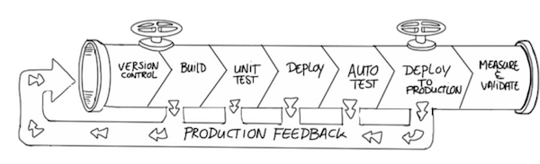

### Continuous workflow

The intent of the continuous workflow is to have the code in a valid and stable state at all times.

Think about the activities that might be required after the code has been completed, but before that modification can be released:
- Put the modified code into Source Code Management (SCM).
- Build code.
- Test the built code.
- Deploy the tested code.
- Freeze a copy of the deployed code.

In the real world, the process is more complicated. Each of these activities can be subdivided into multiple activities with inherent conditionals, such as:
- Only run tests if the build is successful.
- Only run long, complex tests if the simple tests pass.
- Only deploy the software if all tests have passed.

In the not-so-good old days, the Development, Quality Assurance, and Packaging/Deployment groups were often siloed and the process was more like this:
- A large group of developers coded for months.
- Developers handed the "completed" code to Quality Assurance.
- Quality Assurance ran tests and handed bugs back to developers to fix.
- Developers fixed the bugs then handed the code back. to Quality Assurance, who reran the tests.
- Quality Assurance handed the tested code to Packaging/Deployment.
- Packaging/Deployment released the product.

### Modern development philosophies
The philosophies of modern development emphasize collaboration between different teams, flexibility in planning and development, and shorter development cycles. Three major philosophies are interrelated:
- **Agile** - emphasizes adaptive planning and evolutionary development. Work is planned and completed in "sprints" (usually 1-2 weeks of work), with frequent (usually daily) "scrums" where all team members report progress and plan their next steps. See the [Agile Manifesto](https://agilemanifesto.org/).
- **DevOps** - extends the Agile philosophy into operations and production by advocating for the automation and monitoring of all steps in the development cycle. See [What is Devops](https://theagileadmin.com/what-is-devops/)?
- **Continuous** - implements Agile and DevOps philosophies with tools that standardize the steps in the process and thoroughly test each code modification before it is integrated into the official source.

### Agile and continuous philosophies
Agile mostly applies to the earliest steps of the process. Continuous applies to all stages through deployment.

### Continuous philosophy
The continuous philosophy advocates that code be integrated often, at least daily, so that integration is a non-event. Builds are triggered automatically based on **commit** and **merge** actions and the success of upstream builds. In summary:
- Each integration is verified by an **automated** build (including tests).
- Automate the complete build-test-deploy cycle to ensure that activities always run in the same order.
- Build and test each code modification to find problems early when they are easier to fix.

### Continuous integration, delivery, and deployment
**Continuous Integration (CI)** is the frequent, automatic integration of code. All new and modified code is automatically tested with the master code.

**Continuous Delivery (CD)** is the natural extension of CI. It ensures that the code is always ready to be deployed, although manual approval is required to actually deploy the software to production.

**Continuous Deployment** automatically deploys all validated changes to production. Frequent feedback enables issues to be found and fixed quickly.

To successfully implement continuous delivery, it is essential to have a collaborative working relationship with everyone involved. You can then use **Delivery Pipelines**, which are automated implementations of your product’s lifecycle.

