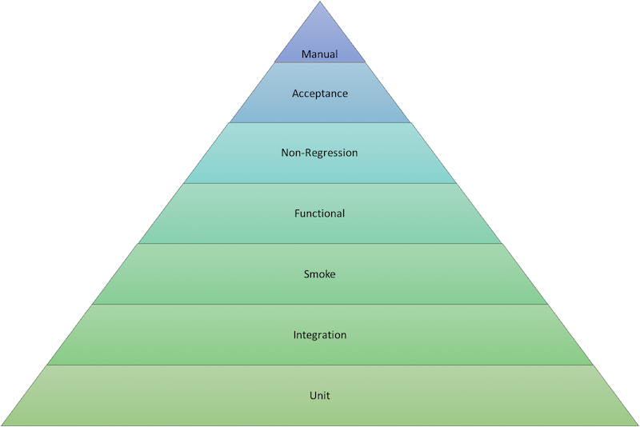

## Software testing

Testing is a critical component of the software development cycle. 
Include a good set of tests as part of your pipeline so your team can:
- Validate that the software meets its goals.
- Search for defects that can be fixed to improve software quality.
- Facilitate refactoring and upgrades by validating that everything is still working after the changes are applied.

This section provides an overview of the role and structure of testing in the build cycle. 
It does not attempt to teach you how to create a complete and excellent set of tests for your project; 
if you want to learn more about good testing practices, the end of this section suggests some resources that are available.

Good testing involves many different types of tests:
- Unit testing, integration testing, smoke testing
- Functional testing
- Non-regression testing
- Acceptance testing
- Code quality and static analysis
- Performance and security testing

The build cycle should report and perhaps archive test results.

### Automated testing
Testing should be automated as much as possible, based on the following principles and practices:
- Tests can be run frequently and always in the same order.
- Running tests frequently means that problems are found early and you usually know which small piece of code caused the problem.
- Automated tests consume machine resources but require little human time beyond what is required to review the test results.
- Tests should be independent from each other as much as possible.
- Many tests can be run in parallel—​especially tests that validate your code for different operating systems or JDK versions.
- Define different tests to run at different stages of the build chain.

### Categories of testing
The testing field has identified different categories of test types; 
you can find long discussions about the proper definitions of all these types of tests.

Test types can be categorized by how quickly they run. Faster automated test types include:
- **Unit tests** test a small piece of code (a function, method, or command). They run the fastest and are often written by the person who writes the code.
- **Integration tests** validate integration between multiple subsystems, including external subsystems such as a database.
- **Smoke tests** (also known as **sanity checking**) validate basic functions of the system.

Slower automated test types include:
- **Functional tests** validate the normal software behaviors against the expectations and requirements.
- **Non-regression tests** validate that the system still produces the same result.
- **Acceptance tests** test the full product from the perspective of the end user use cases and sentiment. These tests usually include manual testing.

Manual testing should be performed rarely, and only on software that has passed all automated tests. 
It is appropriate when the test result is subjective, such as user experience testing, and when the cost of automation is excessive.

### The testing portfolio
Jenkins enables you to run large numbers of tests frequently and at appropriate stages in the build cycle.

Your testing portfolio should have more low-level tests than high-level tests.
- Unit tests usually run every time you compile the code.
- You can define whether functional and non-regression tests run if the unit tests fail.
- Large, broad tests can be set up to run periodically (for example, during non-work hours) rather than being run each time new code is committed.

The Testing Pyramid is a visual representation of these principles:

Therefore, the following principles should be reflected in your testing portfolio:
- The low-level tests at the bottom of the pyramid run quickly and inexpensively and should be run very frequently.
- The higher-level tests at the top of the pyramid take more time to run and are expensive; they should be run less frequently and only on software that has passed all the tests that are lower on the pyramid.
- When low-level tests fail, it seldom makes sense to run higher-level tests before fixing the problems detected by the low-level tests.
- When a higher-level test fails, consider that it may have detected a defect in the lower-level tests as well as a defect in the code.

Learn more about software testing
Software testing is a vast subject with many excellent courses, books, and articles available. Here are a few articles to get you started:
- The StackOverflow [What are unit tests, integration tests, smoke tests, and regression tests?](https://stackoverflow.com/questions/520064/what-is-unit-test-integration-test-smoke-test-regression-test) discussion introduces the types of testing you can perform.
- [Wikipedia article about Software Testing](https://en.wikipedia.org/wiki/Software_testing) provides a comprehensive summary and bibliography about types of testing and tools to use.
- Martin Fowler writes extensively about software development, and proper testing figures prominently in his writing. 
  To get started, read the articles on his [tagged by: testing](https://martinfowler.com/tags/testing.html) page. 
  You may also enjoy his articles about [Unit testing](https://martinfowler.com/bliki/UnitTest.html), [Test Coverage](https://martinfowler.com/bliki/TestCoverage.html), and [Test Driven Development](https://martinfowler.com/bliki/TestDrivenDevelopment.html)

If you want to further explore the fine points of software testing, Black Box Software Testing (BBST) by Cem Kaner offers a series of four six-week courses about testing. Each course contains video lectures and exams:
- [About the Black Box Software Testing Courses](https://www.associationforsoftwaretesting.org/courses/)
- [BBST Courses Offering at Altom](https://altom.training/#courses)
